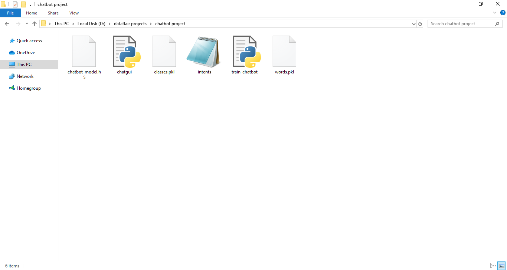
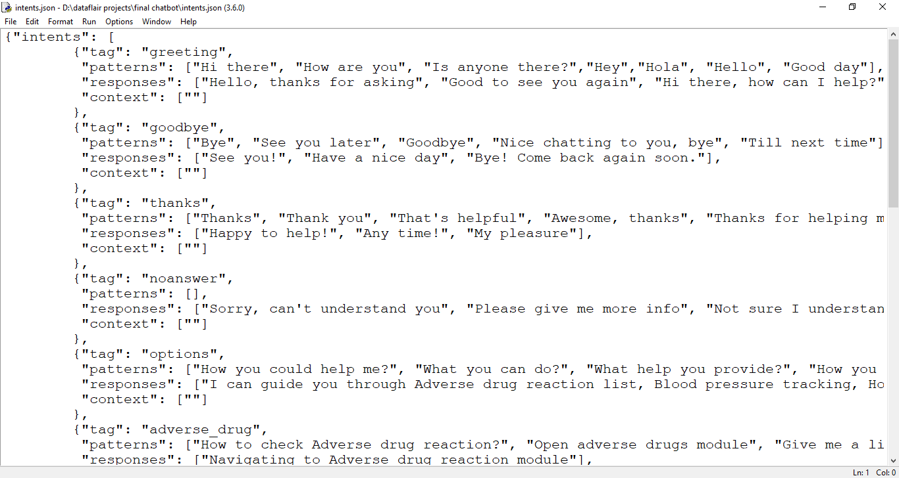
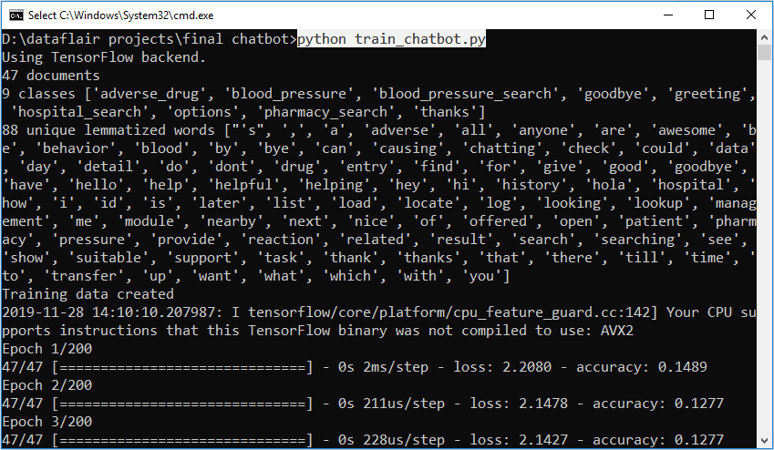
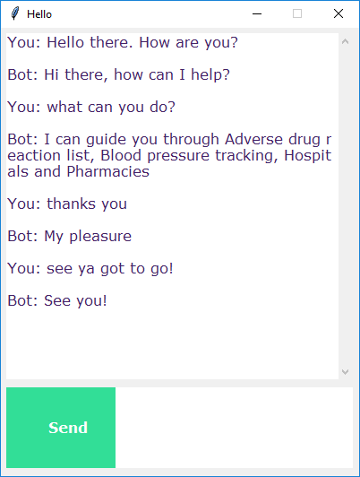

**What is Chatbot?**

A chatbot is an intelligent piece of software that is capable of communicating and performing actions similar to a human. Chatbots are used a lot in customer interaction, marketing on social network sites and instantly messaging the client. There are two basic types of chatbot models based on how they are built; Retrieval based and Generative based models.

\1. Retrieval based Chatbots

A retrieval-based chatbot uses predefined input patterns and responses. It then uses some type of heuristic approach to select the appropriate response. It is widely used in the industry to make goal-oriented chatbots where we can customize the tone and flow of the chatbot to drive our customers with the best experience.

**2. Generative based Chatbots**

Generative models are not based on some predefined responses.

They are based on seq 2 seq neural networks. It is the same idea as machine translation. In machine translation, we translate the source code from one language to another language but here, we are going to transform input into an output. It needs a large amount of data and it is based on Deep Neural networks.

**About the Python Project – Chatbot**

In this Python project with source code, we are going to build a chatbot using deep learning techniques. The chatbot will be trained on the dataset which contains categories (intents), pattern and responses. We use a special recurrent neural network (LSTM) to classify which category the user’s message belongs to and then we will give a random response from the list of responses.

Let’s create a retrieval based chatbot using NLTK, Keras, Python, etc.

**The Dataset**

The dataset we will be using is ‘intents.json’. This is a JSON file that contains the patterns we need to find and the responses we want to return to the user. The link to the project is available below:

[**Python Chatbot Project Dataset**](https://drive.google.com/open?id=1763Y5zy7HmRYsOoBLQgUxQRGY6xCgQiN)

**Prerequisites**

The project requires you to have good knowledge of Python, Keras, and [**Natural language processing (NLTK)**](https://data-flair.training/blogs/nltk-python-tutorial/). Along with them, we will use some helping modules which you can download using the python-pip command.

pip install tensorflow, keras, pickle, nltk

**How to Make Chatbot in Python?**

Now we are going to build the chatbot using Python but first, let us see the file structure and the type of files we will be creating:

- **Intents.json –** The data file which has predefined patterns and responses.
- **train\_chatbot.py –** In this Python file, we wrote a script to build the model and train our chatbot.
- **Words.pkl –** This is a pickle file in which we store the words Python object that contains a list of our vocabulary.
- **Classes.pkl –** The classes pickle file contains the list of categories.
- **Chatbot\_model.h5 –** This is the trained model that contains information about the model and has weights of the neurons.
- **Chatgui.py –** This is the Python script in which we implemented GUI for our chatbot. Users can easily interact with the bot.

Here are the 5 steps to create a chatbot in Python from scratch:

1. Import and load the data file
1. Preprocess data
1. Create training and testing data
1. Build the model
1. Predict the response

**1. Import and load the data file**

First, make a file name as train\_chatbot.py. We import the necessary packages for our chatbot and initialize the variables we will use in our Python project.

The data file is in JSON format so we used the json package to parse the JSON file into [Python](https://www.python.org/).

import nltk

from nltk.stem import WordNetLemmatizer

lemmatizer = WordNetLemmatizer()

import json

import pickle

import numpy as np

from keras.models import Sequential

from keras.layers import Dense, Activation, Dropout

from keras.optimizers import SGD

import random

words=[]

classes = []

documents = []

ignore\_words = ['?', '!']

data\_file = open('intents.json').read()

intents = json.loads(data\_file)

This is how our intents.json file looks like.

**2. Preprocess data**

When working with text data, we need to perform various preprocessing on the data before we make a machine learning or a deep learning model. Tokenizing is the most basic and first thing you can do on text data. Tokenizing is the process of breaking the whole text into small parts like words.

Here we iterate through the patterns and tokenize the sentence using nltk.word\_tokenize() function and append each word in the words list. We also create a list of classes for our tags.

for intent in intents['intents']:

`    `for pattern in intent['patterns']:

`        `#tokenize each word

`        `w = nltk.word\_tokenize(pattern)

`        `words.extend(w)

`        `#add documents in the corpus

`        `documents.append((w, intent['tag']))

`        `# add to our classes list

`        `if intent['tag'] not in classes:

`            `classes.append(intent['tag'])

Now we will lemmatize each word and remove duplicate words from the list. Lemmatizing is the process of converting a word into its lemma form and then creating a pickle file to store the Python objects which we will use while predicting.

\# lemmatize, lower each word and remove duplicates

words = [lemmatizer.lemmatize(w.lower()) for w in words if w not in ignore\_words]

words = sorted(list(set(words)))

\# sort classes

classes = sorted(list(set(classes)))

\# documents = combination between patterns and intents

print (len(documents), "documents")

\# classes = intents

print (len(classes), "classes", classes)

\# words = all words, vocabulary

print (len(words), "unique lemmatized words", words)

pickle.dump(words,open('words.pkl','wb'))

pickle.dump(classes,open('classes.pkl','wb'))

**3. Create training and testing data**

Now, we will create the training data in which we will provide the input and the output. Our input will be the pattern and output will be the class our input pattern belongs to. But the computer doesn’t understand text so we will convert text into numbers.

\# create our training data

training = []

\# create an empty array for our output

output\_empty = [0] \* len(classes)

\# training set, bag of words for each sentence

for doc in documents:

`    `# initialize our bag of words

`    `bag = []

`    `# list of tokenized words for the pattern

`    `pattern\_words = doc[0]

`    `# lemmatize each word - create base word, in attempt to represent related words

`    `pattern\_words = [lemmatizer.lemmatize(word.lower()) for word in pattern\_words]

`    `# create our bag of words array with 1, if word match found in current pattern

for w in words:

bag.append(1) if w in pattern\_words else bag.append(0)

`    `# output is a '0' for each tag and '1' for current tag (for each pattern)

`    `output\_row = list(output\_empty)

`    `output\_row[classes.index(doc[1])] = 1

`    `training.append([bag, output\_row])

\# shuffle our features and turn into np.array

random.shuffle(training)

training = np.array(training)

\# create train and test lists. X - patterns, Y - intents

train\_x = list(training[:,0])

train\_y = list(training[:,1])

print("Training data created")

**4. Build the model**

We have our training data ready, now we will build a deep neural network that has 3 layers. We use the Keras sequential API for this. After training the model for 200 epochs, we achieved 100% accuracy on our model. Let us save the model as ‘chatbot\_model.h5’.

\# Create model - 3 layers. First layer 128 neurons, second layer 64 neurons and 3rd output layer contains number of neurons

\# equal to number of intents to predict output intent with softmax

model = Sequential()

model.add(Dense(128, input\_shape=(len(train\_x[0]),), activation='relu'))

model.add(Dropout(0.5))

model.add(Dense(64, activation='relu'))

model.add(Dropout(0.5))

model.add(Dense(len(train\_y[0]), activation='softmax'))

\# Compile model. Stochastic gradient descent with Nesterov accelerated gradient gives good results for this model

sgd = SGD(lr=0.01, decay=1e-6, momentum=0.9, nesterov=True)

model.compile(loss='categorical\_crossentropy', optimizer=sgd, metrics=['accuracy'])

#fitting and saving the model 

hist = model.fit(np.array(train\_x), np.array(train\_y), epochs=200, batch\_size=5, verbose=1)

model.save('chatbot\_model.h5', hist)

print("model created")

**5. Predict the response (Graphical User Interface)**

Now to predict the sentences and get a response from the user to let us create a new file ‘chatapp.py’.

We will load the trained model and then use a graphical user interface that will predict the response from the bot. The model will only tell us the class it belongs to, so we will implement some functions which will identify the class and then retrieve us a random response from the list of responses.

Again we import the necessary packages and load the ‘words.pkl’ and ‘classes.pkl’ pickle files which we have created when we trained our model:

import nltk

from nltk.stem import WordNetLemmatizer

lemmatizer = WordNetLemmatizer()

import pickle

import numpy as np

from keras.models import load\_model

model = load\_model('chatbot\_model.h5')

import json

import random

intents = json.loads(open('intents.json').read())

words = pickle.load(open('words.pkl','rb'))

classes = pickle.load(open('classes.pkl','rb'))

To predict the class, we will need to provide input in the same way as we did while training. So we will create some functions that will perform text preprocessing and then predict the class.

def clean\_up\_sentence(sentence):

`    `# tokenize the pattern - split words into array

`    `sentence\_words = nltk.word\_tokenize(sentence)

`    `# stem each word - create short form for word

`    `sentence\_words = [lemmatizer.lemmatize(word.lower()) for word in sentence\_words]

`    `return sentence\_words

\# return bag of words array: 0 or 1 for each word in the bag that exists in the sentence

def bow(sentence, words, show\_details=True):

`    `# tokenize the pattern

`    `sentence\_words = clean\_up\_sentence(sentence)

`    `# bag of words - matrix of N words, vocabulary matrix

`    `bag = [0]\*len(words) 

`    `for s in sentence\_words:

`        `for i,w in enumerate(words):

`            `if w == s: 

`                `# assign 1 if current word is in the vocabulary position

`                `bag[i] = 1

`                `if show\_details:

`                    `print ("found in bag: %s" % w)

`    `return(np.array(bag))

def predict\_class(sentence, model):

`    `# filter out predictions below a threshold

`    `p = bow(sentence, words,show\_details=False)

`    `res = model.predict(np.array([p]))[0]

`    `ERROR\_THRESHOLD = 0.25

`    `results = [[i,r] for i,r in enumerate(res) if r>ERROR\_THRESHOLD]

`    `# sort by strength of probability

`    `results.sort(key=lambda x: x[1], reverse=True)

`    `return\_list = []

`    `for r in results:

`        `return\_list.append({"intent": classes[r[0]], "probability": str(r[1])})

`    `return return\_list

After predicting the class, we will get a random response from the list of intents.

def getResponse(ints, intents\_json):

`    `tag = ints[0]['intent']

`    `list\_of\_intents = intents\_json['intents']

`    `for i in list\_of\_intents:

`        `if(i['tag']== tag):

`            `result = random.choice(i['responses'])

`            `break

`    `return result

def chatbot\_response(text):

`    `ints = predict\_class(text, model)

`    `res = getResponse(ints, intents)

`    `return res

Now we will code a graphical user interface. For this, we use the Tkinter library which already comes in python. We will take the input message from the user and then use the helper functions we have created to get the response from the bot and display it on the GUI. Here is the full source code for the GUI.

#Creating GUI with tkinter

import tkinter

from tkinter import \*

def send():

`    `msg = EntryBox.get("1.0",'end-1c').strip()

`    `EntryBox.delete("0.0",END)

if msg != '':

`        `ChatLog.config(state=NORMAL)

`        `ChatLog.insert(END, "You: " + msg + '\n\n')

`        `ChatLog.config(foreground="#442265", font=("Verdana", 12 ))

`        `res = chatbot\_response(msg)

`        `ChatLog.insert(END, "Bot: " + res + '\n\n')

`        `ChatLog.config(state=DISABLED)

`        `ChatLog.yview(END)

base = Tk()

base.title("Hello")

base.geometry("400x500")

base.resizable(width=FALSE, height=FALSE)

#Create Chat window

ChatLog = Text(base, bd=0, bg="white", height="8", width="50", font="Arial",)

ChatLog.config(state=DISABLED)

#Bind scrollbar to Chat window

scrollbar = Scrollbar(base, command=ChatLog.yview, cursor="heart")

ChatLog['yscrollcommand'] = scrollbar.set

#Create Button to send message

SendButton = Button(base, font=("Verdana",12,'bold'), text="Send", width="12", height=5,

`                    `bd=0, bg="#32de97", activebackground="#3c9d9b",fg='#ffffff',

`                    `command= send )

#Create the box to enter message

EntryBox = Text(base, bd=0, bg="white",width="29", height="5", font="Arial")

#EntryBox.bind("<Return>", send)

#Place all components on the screen

scrollbar.place(x=376,y=6, height=386)

ChatLog.place(x=6,y=6, height=386, width=370)

EntryBox.place(x=128, y=401, height=90, width=265)

SendButton.place(x=6, y=401, height=90)

base.mainloop()

**6. Run the chatbot**

To run the chatbot, we have two main files; **train\_chatbot.py** and **chatapp.py**.

First, we train the model using the command in the terminal:

python train\_chatbot.py

If we don’t see any error during training, we have successfully created the model. Then to run the app, we run the second file.

python chatgui.py

The program will open up a GUI window within a few seconds. With the GUI you can easily chat with the bot.

**Screenshots:**

**Summary**

In this Python data science project, we understood about chatbots and implemented a deep learning version of a chatbot in Python which is accurate. You can customize the data according to business requirements and train the chatbot with great accuracy. Chatbots are used everywhere and all businesses is looking forward to implementing bot in their workflow.

