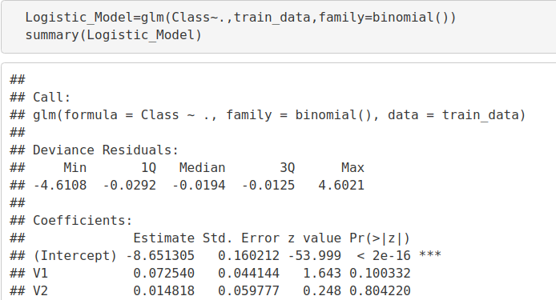

**Machine Learning Project – How to Detect Credit Card Fraud**

The aim of this R project is to build a classifier that can detect credit card fraudulent transactions. We will use a variety of [**machine learning algorithms**](https://data-flair.training/blogs/machine-learning-algorithm/) that will be able to discern fraudulent from non-fraudulent one. By the end of this machine learning project, you will learn how to implement machine learning algorithms to perform classification.

*The dataset used in this project is available here* **– [***Fraud Detection Dataset*](https://drive.google.com/file/d/1CTAlmlREFRaEN3NoHHitewpqAtWS5cVQ/view)**

**1. Importing the Datasets**

We are importing the datasets that contain transactions made by credit cards-

**Code:**

library(ranger)

library(caret)

library(data.table)

creditcard\_data <- read.csv("/home/dataflair/data/Credit Card/creditcard.csv")

**Input Screenshot:**

**Before moving on, you must revise the [concepts of R Dataframes**](https://data-flair.training/blogs/r-data-frame-introduction-operations/)**

**2. Data Exploration**

In this section of the fraud detection ML project, we will explore the data that is contained in the creditcard\_data dataframe. We will proceed by displaying the creditcard\_data using the head() function as well as the tail() function. We will then proceed to explore the other components of this dataframe –

**Code:**

dim(creditcard\_data)

head(creditcard\_data,6)

**Output Screenshot:**

**Code:**

tail(creditcard\_data,6)

**Output Screenshot:**

**Code:**

table(creditcard\_data$Class)

summary(creditcard\_data$Amount)

names(creditcard\_data)

var(creditcard\_data$Amount)

**Output Screenshot:**

**Code:**

sd(creditcard\_data$Amount)

**Output Screenshot:**

[**Learn everything about R](https://data-flair.training/blogs/r-tutorials-home/) **for FREE and master the technology**

**3. Data Manipulation**

In this section of the R data science project, we will scale our data using the scale() function. We will apply this to the amount component of our creditcard\_data amount. Scaling is also known as feature standardization. With the help of scaling, the data is structured according to a specified range. Therefore, there are no extreme values in our dataset that might interfere with the functioning of our model. We will carry this out as follows:

**Code:**

head(creditcard\_data)

**Output Screenshot:**

**Code:**

creditcard\_data$Amount=scale(creditcard\_data$Amount)

NewData=creditcard\_data[,-c(1)]

head(NewData)

**Output Screenshot:**

**4. Data Modeling**

After we have standardized our entire dataset, we will split our dataset into training set as well as test set with a split ratio of 0.80. This means that 80% of our data will be attributed to the train\_data whereas 20% will be attributed to the test data. We will then find the dimensions using the dim() function –

**Code:**

library(caTools)

set.seed(123)

data\_sample = sample.split(NewData$Class,SplitRatio=0.80)

train\_data = subset(NewData,data\_sample==TRUE)

test\_data = subset(NewData,data\_sample==FALSE)

dim(train\_data)

dim(test\_data)

**Output Screenshot:**

**5. Fitting Logistic Regression Model**

In this section of credit card fraud detection project, we will fit our first model. We will begin with logistic regression. A logistic regression is used for modeling the outcome probability of a class such as pass/fail, positive/negative and in our case – fraud/not fraud. We proceed to implement this model on our test data as follows –

**Code:**

Logistic\_Model=glm(Class~.,test\_data,family=binomial())

summary(Logistic\_Model)

**Output Screenshot:**

After we have summarised our model, we will visual it through the following plots –

**Code:**

plot(Logistic\_Model)

**Input Screenshot:**

**Output:**

**Output:**

**Output:**

**Output:**

In order to assess the performance of our model, we will delineate the ROC curve. ROC is also known as Receiver Optimistic Characteristics. For this, we will first import the ROC package and then plot our [ROC](https://en.wikipedia.org/wiki/Receiver_operating_characteristic) curve to analyze its performance.

**Code:**

library(pROC)

lr.predict <- predict(Logistic\_Model,train\_data, probability = TRUE)

auc.gbm = roc(test\_data$Class, lr.predict, plot = TRUE, col = "blue")

**Output Screenshot:**

**Output:**

**6. Fitting a Decision Tree Model**

In this section, we will implement a decision tree algorithm. [**Decision Trees**](https://data-flair.training/blogs/r-decision-trees/) to plot the outcomes of a decision. These outcomes are basically a consequence through which we can conclude as to what class the object belongs to. We will now implement our decision tree model and will plot it using the rpart.plot() function. We will specifically use the recursive parting to plot the decision tree.

**Code:**

library(rpart)

library(rpart.plot)

decisionTree\_model <- rpart(Class ~ . , creditcard\_data, method = 'class')

predicted\_val <- predict(decisionTree\_model, creditcard\_data, type = 'class')

probability <- predict(decisionTree\_model, creditcard\_data, type = 'prob')

rpart.plot(decisionTree\_model)

**Input Screenshot:**

**Output:**

**7. Artificial Neural Network**

[**Artificial Neural Networks**](https://data-flair.training/blogs/artificial-neural-network/) are a type of machine learning algorithm that are modeled after the human nervous system. The ANN models are able to learn the patterns using the historical data and are able to perform classification on the input data. We import the neuralnet package that would allow us to implement our ANNs. Then we proceeded to plot it using the plot() function. Now, in the case of Artificial Neural Networks, there is a range of values that is between 1 and 0. We set a threshold as 0.5, that is, values above 0.5 will correspond to 1 and the rest will be 0. We implement this as follows – 

**Code:**

library(neuralnet)

ANN\_model =neuralnet (Class~.,train\_data,linear.output=FALSE)

plot(ANN\_model)

predANN=compute(ANN\_model,test\_data)

resultANN=predANN$net.result

resultANN=ifelse(resultANN>0.5,1,0)

**Input Screenshot:**

**Output:**

**8. Gradient Boosting (GBM)**

[**Gradient Boosting**](https://data-flair.training/blogs/gradient-boosting-algorithm/) is a popular machine learning algorithm that is used to perform classification and regression tasks. This model comprises of several underlying ensemble models like weak decision trees. These decision trees combine together to form a strong model of gradient boosting. We will implement gradient descent algorithm in our model as follows –

**Code:**

library(gbm, quietly=TRUE)

\# Get the time to train the GBM model

system.time(

`       `model\_gbm <- gbm(Class ~ .

`               `, distribution = "bernoulli"

`               `, data = rbind(train\_data, test\_data)

`               `, n.trees = 500

`               `, interaction.depth = 3

`               `, n.minobsinnode = 100

`               `, shrinkage = 0.01

`               `, bag.fraction = 0.5

`               `, train.fraction = nrow(train\_data) / (nrow(train\_data) + nrow(test\_data))

)

)

\# Determine best iteration based on test data

gbm.iter = gbm.perf(model\_gbm, method = "test")

**Input Screenshot:**

**Code:**

model.influence = relative.influence(model\_gbm, n.trees = gbm.iter, sort. = TRUE)

#Plot the gbm model

plot(model\_gbm)

**Input Screenshot:**

**Output:**

**Output:**

**Code:**

\# Plot and calculate AUC on test data

gbm\_test = predict(model\_gbm, newdata = test\_data, n.trees = gbm.iter)

gbm\_auc = roc(test\_data$Class, gbm\_test, plot = TRUE, col = "red")

**Output Screenshot:**

**Code:**

print(gbm\_auc)

**Output Screenshot:**

**Summary**

Concluding our R Data Science project, we learnt how to develop our credit card fraud detection model using machine learning. We used a variety of ML algorithms to implement this model and also plotted the respective performance curves for the models. We learnt how data can be analyzed and visualized to discern fraudulent transactions from other types of data.

