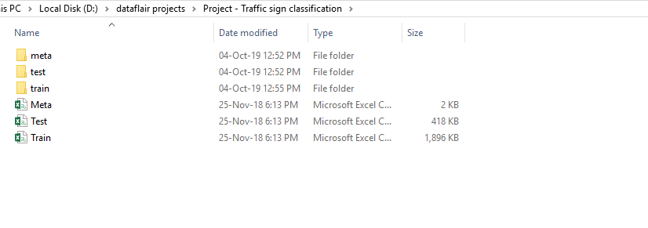
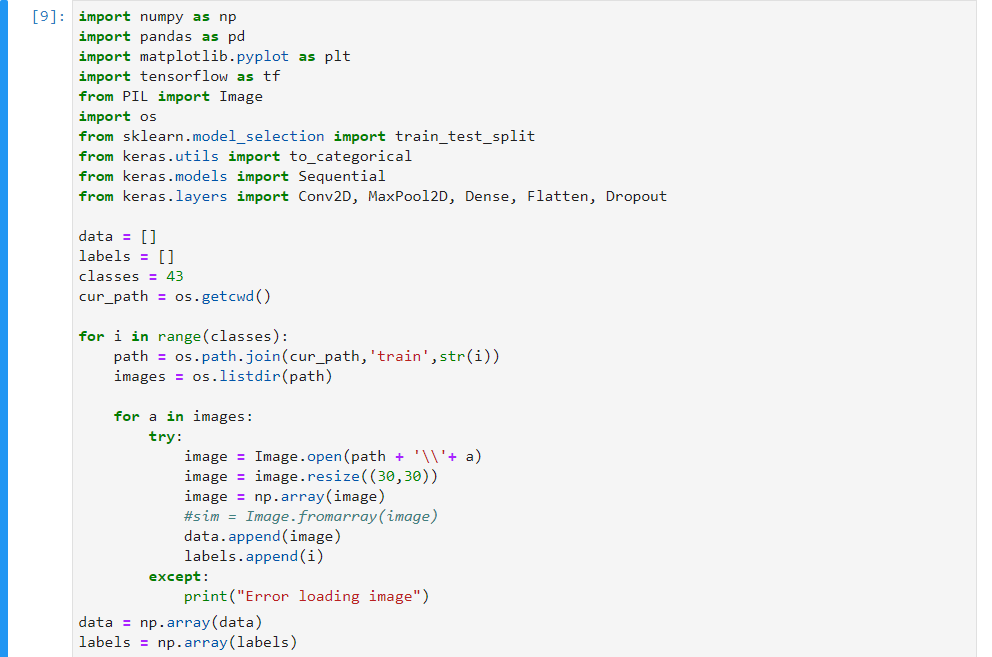
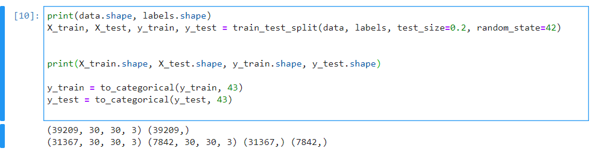
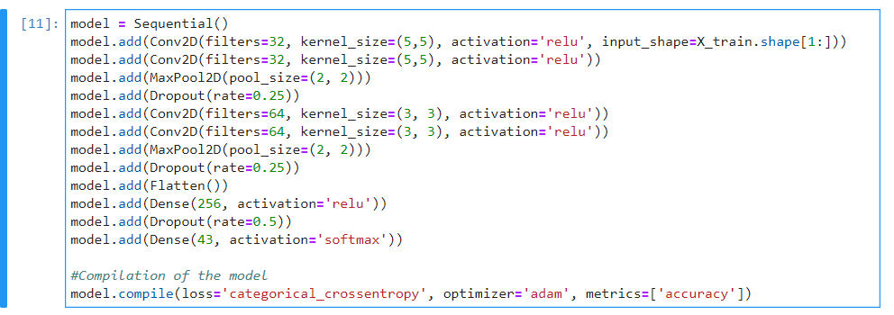
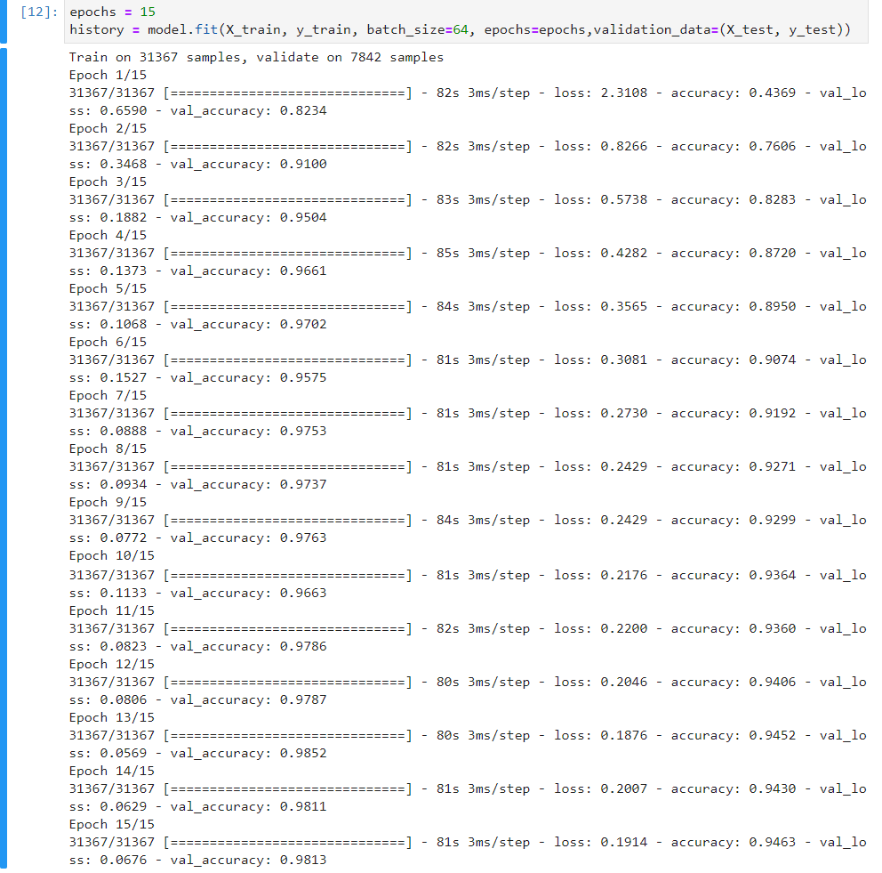
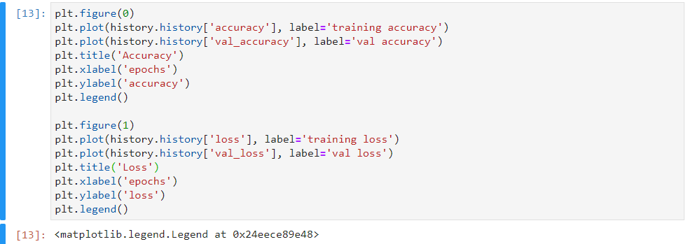
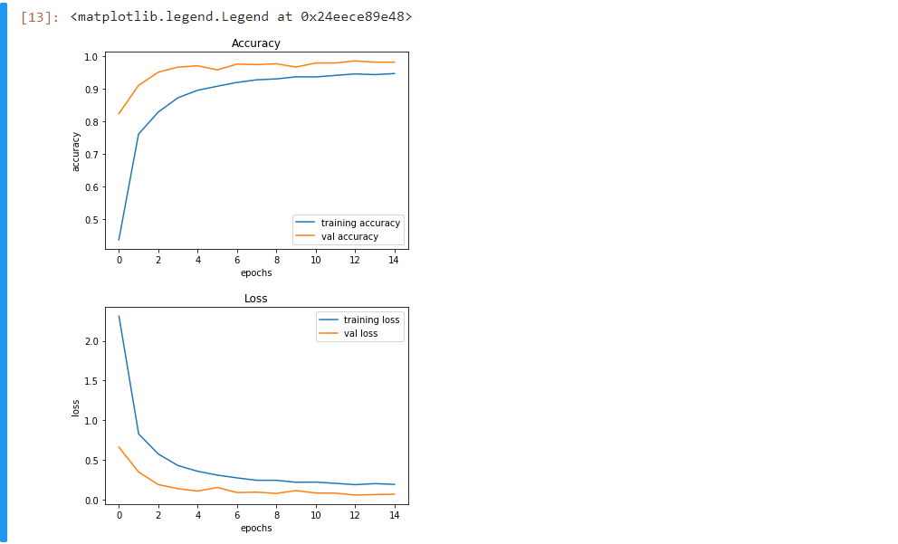
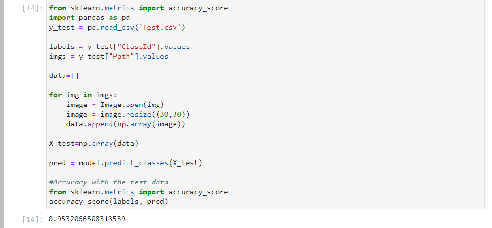
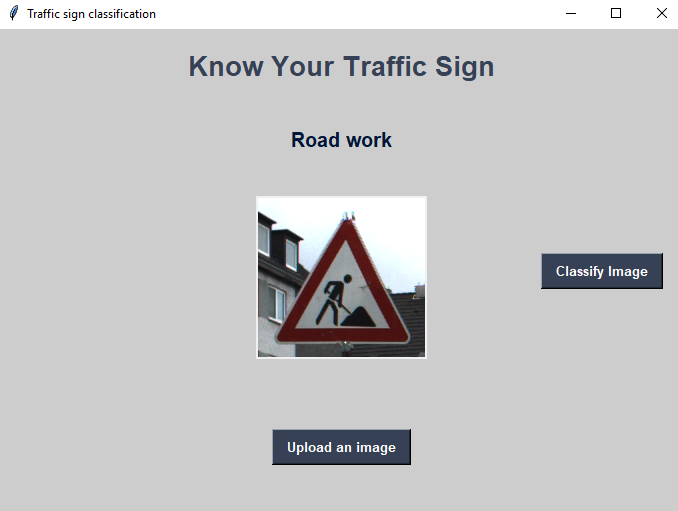

**What is Traffic Signs Recognition?**

There are several different types of traffic signs like speed limits, no entry, traffic signals, turn left or right, children crossing, no passing of heavy vehicles, etc. Traffic signs classification is the process of identifying which class a traffic sign belongs to.

**Traffic Signs Recognition – About the Python Project**

In this Python project example, we will build a deep neural network model that can classify traffic signs present in the image into different categories. With this model, we are able to read and understand traffic signs which are a very important task for all autonomous vehicles.

**The Dataset of Python Project**

For this project, we are using the public dataset available at Kaggle:

[Traffic Signs Dataset](https://www.kaggle.com/meowmeowmeowmeowmeow/gtsrb-german-traffic-sign)

The dataset contains more than 50,000 images of different traffic signs. It is further classified into 43 different classes. The dataset is quite varying, some of the classes have many images while some classes have few images. The size of the dataset is around 300 MB. The dataset has a train folder which contains images inside each class and a test folder which we will use for testing our model.

**Prerequisites**

This project requires prior knowledge of Keras, Matplotlib, Scikit-learn, Pandas, PIL and image classification.

To install the necessary packages used for this Python data science project, enter the below command in your terminal:

pip install tensorflow keras sklearn matplotlib pandas pil

` `Steps to Build the Python Project

To get started with the project, download and unzip the file from this link – [Traffic Signs Recognition Zip File](https://drive.google.com/open?id=1BGDHe6qQwrBEgnl-tXTSKo6TvDj8U3wS)

And extract the files into a folder such that you will have a train, test and a meta folder.

Create a Python script file and name it traffic\_signs.py in the project folder.

Our approach to building this traffic sign classification model is discussed in four steps:

- Explore the dataset
- Build a CNN model
- Train and validate the model
- Test the model with test dataset

**Step 1: Explore the dataset**

Our ‘train’ folder contains 43 folders each representing a different class. The range of the folder is from 0 to 42. With the help of the OS module, we iterate over all the classes and append images and their respective labels in the data and labels list.

The PIL library is used to open image content into an array.

Finally, we have stored all the images and their labels into lists (data and labels).

We need to convert the list into numpy arrays for feeding to the model.

The shape of data is (39209, 30, 30, 3) which means that there are 39,209 images of size 30×30 pixels and the last 3 means the data contains colored images (RGB value).

With the sklearn package, we use the train\_test\_split() method to split training and testing data.

From the keras.utils package, we use to\_categorical method to convert the labels present in y\_train and t\_test into one-hot encoding.

**Step 2: Build a CNN model**

To classify the images into their respective categories, we will build a CNN model ([**Convolutional Neural Network**](https://data-flair.training/blogs/convolutional-neural-networks-tutorial/)). CNN is best for image classification purposes.

The architecture of our model is:

- 2 Conv2D layer (filter=32, kernel\_size=(5,5), activation=”relu”)
- MaxPool2D layer ( pool\_size=(2,2))
- Dropout layer (rate=0.25)
- 2 Conv2D layer (filter=64, kernel\_size=(3,3), activation=”relu”)
- MaxPool2D layer ( pool\_size=(2,2))
- Dropout layer (rate=0.25)
- Flatten layer to squeeze the layers into 1 dimension
- Dense Fully connected layer (256 nodes, activation=”relu”)
- Dropout layer (rate=0.5)
- Dense layer (43 nodes, activation=”softmax”)

We compile the model with Adam optimizer which performs well and loss is “categorical\_crossentropy” because we have multiple classes to categorise.

**Steps 3: Train and validate the model**

After building the model architecture, we then train the model using model.fit(). I tried with batch size 32 and 64. Our model performed better with 64 batch size. And after 15 epochs the accuracy was stable.

Our model got a 95% accuracy on the training dataset. With matplotlib, we plot the graph for accuracy and the loss.

Plotting Accuracy

Accuracy and Loss Graphs

**Step 4: Test our model with test dataset**

Our dataset contains a test folder and in a test.csv file, we have the details related to the image path and their respective class labels. We extract the image path and labels using pandas. Then to predict the model, we have to resize our images to 30×30 pixels and make a numpy array containing all image data. From the sklearn.metrics, we imported the accuracy\_score and observed how our model predicted the actual labels. We achieved a 95% accuracy in this model.

In the end, we are going to save the model that we have trained using the Keras model.save() function.

model.save(‘traffic\_classifier.h5’)

**Full Source code:**

import numpy as np 

import pandas as pd 

import matplotlib.pyplot as plt

import cv2

import tensorflow as tf

from PIL import Image

import os

from sklearn.model\_selection import train\_test\_split

from keras.utils import to\_categorical

from keras.models import Sequential, load\_model

from keras.layers import Conv2D, MaxPool2D, Dense, Flatten, Dropout

data = []

labels = []

classes = 43

cur\_path = os.getcwd()

#Retrieving the images and their labels 

for i in range(classes):

`    `path = os.path.join(cur\_path,'train',str(i))

`    `images = os.listdir(path)

`    `for a in images:

`        `try:

`            `image = Image.open(path + '\\'+ a)

`            `image = image.resize((30,30))

`            `image = np.array(image)

`            `#sim = Image.fromarray(image)

`            `data.append(image)

`            `labels.append(i)

`        `except:

`            `print("Error loading image")

#Converting lists into numpy arrays

data = np.array(data)

labels = np.array(labels)

print(data.shape, labels.shape)

#Splitting training and testing dataset

X\_train, X\_test, y\_train, y\_test = train\_test\_split(data, labels, test\_size=0.2, random\_state=42)

print(X\_train.shape, X\_test.shape, y\_train.shape, y\_test.shape)

#Converting the labels into one hot encoding

y\_train = to\_categorical(y\_train, 43)

y\_test = to\_categorical(y\_test, 43)

#Building the model

model = Sequential()

model.add(Conv2D(filters=32, kernel\_size=(5,5), activation='relu', input\_shape=X\_train.shape[1:]))

model.add(Conv2D(filters=32, kernel\_size=(5,5), activation='relu'))

model.add(MaxPool2D(pool\_size=(2, 2)))

model.add(Dropout(rate=0.25))

model.add(Conv2D(filters=64, kernel\_size=(3, 3), activation='relu'))

model.add(Conv2D(filters=64, kernel\_size=(3, 3), activation='relu'))

model.add(MaxPool2D(pool\_size=(2, 2)))

model.add(Dropout(rate=0.25))

model.add(Flatten())

model.add(Dense(256, activation='relu'))

model.add(Dropout(rate=0.5))

model.add(Dense(43, activation='softmax'))

#Compilation of the model

model.compile(loss='categorical\_crossentropy', optimizer='adam', metrics=['accuracy'])

epochs = 15

history = model.fit(X\_train, y\_train, batch\_size=32, epochs=epochs, validation\_data=(X\_test, y\_test))

model.save("my\_model.h5")

#plotting graphs for accuracy 

plt.figure(0)

plt.plot(history.history['accuracy'], label='training accuracy')

plt.plot(history.history['val\_accuracy'], label='val accuracy')

plt.title('Accuracy')

plt.xlabel('epochs')

plt.ylabel('accuracy')

plt.legend()

plt.show()

plt.figure(1)

plt.plot(history.history['loss'], label='training loss')

plt.plot(history.history['val\_loss'], label='val loss')

plt.title('Loss')

plt.xlabel('epochs')

plt.ylabel('loss')

plt.legend()

plt.show()

#testing accuracy on test dataset

from sklearn.metrics import accuracy\_score

y\_test = pd.read\_csv('Test.csv')

labels = y\_test["ClassId"].values

imgs = y\_test["Path"].values

data=[]

for img in imgs:

`    `image = Image.open(img)

`    `image = image.resize((30,30))

`    `data.append(np.array(image))

X\_test=np.array(data)

pred = model.predict\_classes(X\_test)

#Accuracy with the test data

from sklearn.metrics import accuracy\_score

print(accuracy\_score(labels, pred))

model.save(‘traffic\_classifier.h5’)

[**Traffic Signs Classifier GUI**](https://data-flair.training/blogs/opencv-python-tutorial/)

Now we are going to build a graphical user interface for our traffic signs classifier with Tkinter. Tkinter is a GUI toolkit in the standard python library. Make a new file in the project folder and copy the below code. Save it as gui.py and you can run the code by typing python gui.py in the command line.

In this file, we have first loaded the trained model ‘traffic\_classifier.h5’ using Keras. And then we build the GUI for uploading the image and a button is used to classify which calls the classify() function. The classify() function is converting the image into the dimension of shape (1, 30, 30, 3). This is because to predict the traffic sign we have to provide the same dimension we have used when building the model. Then we predict the class, the model.predict\_classes(image) returns us a number between (0-42) which represents the class it belongs to. We use the dictionary to get the information about the class. Here’s the code for the gui.py file.

**Code:**

import tkinter as tk

from tkinter import filedialog

from tkinter import \*

from PIL import ImageTk, Image

import numpy

#load the trained model to classify sign

from keras.models import load\_model

model = load\_model('traffic\_classifier.h5')

#dictionary to label all traffic signs class.

classes = { 1:'Speed limit (20km/h)',

`            `2:'Speed limit (30km/h)', 

`            `3:'Speed limit (50km/h)', 

`            `4:'Speed limit (60km/h)', 

`            `5:'Speed limit (70km/h)', 

`            `6:'Speed limit (80km/h)', 

`            `7:'End of speed limit (80km/h)', 

`            `8:'Speed limit (100km/h)', 

`            `9:'Speed limit (120km/h)', 

`            `10:'No passing', 

`            `11:'No passing veh over 3.5 tons', 

`            `12:'Right-of-way at intersection', 

`            `13:'Priority road', 

`            `14:'Yield', 

`            `15:'Stop', 

`            `16:'No vehicles', 

`            `17:'Veh > 3.5 tons prohibited', 

`            `18:'No entry', 

`            `19:'General caution', 

`            `20:'Dangerous curve left', 

`            `21:'Dangerous curve right', 

`            `22:'Double curve', 

`            `23:'Bumpy road', 

`            `24:'Slippery road', 

`            `25:'Road narrows on the right', 

`            `26:'Road work', 

`            `27:'Traffic signals', 

`            `28:'Pedestrians', 

`            `29:'Children crossing', 

`            `30:'Bicycles crossing', 

`            `31:'Beware of ice/snow',

`            `32:'Wild animals crossing', 

`            `33:'End speed + passing limits', 

`            `34:'Turn right ahead', 

`            `35:'Turn left ahead', 

`            `36:'Ahead only', 

`            `37:'Go straight or right', 

`            `38:'Go straight or left', 

`            `39:'Keep right', 

`            `40:'Keep left', 

`            `41:'Roundabout mandatory', 

`            `42:'End of no passing', 

`            `43:'End no passing veh > 3.5 tons' }

#initialise GUI

top=tk.Tk()

top.geometry('800x600')

top.title('Traffic sign classification')

top.configure(background='#CDCDCD')

label=Label(top,background='#CDCDCD', font=('arial',15,'bold'))

sign\_image = Label(top)

def classify(file\_path):

`    `global label\_packed

`    `image = Image.open(file\_path)

`    `image = image.resize((30,30))

`    `image = numpy.expand\_dims(image, axis=0)

`    `image = numpy.array(image)

`    `pred = model.predict\_classes([image])[0]

`    `sign = classes[pred+1]

`    `print(sign)

`    `label.configure(foreground='#011638', text=sign) 

def show\_classify\_button(file\_path):

`    `classify\_b=Button(top,text="Classify Image",command=lambda: classify(file\_path),padx=10,pady=5)

`    `classify\_b.configure(background='#364156', foreground='white',font=('arial',10,'bold'))

`    `classify\_b.place(relx=0.79,rely=0.46)

def upload\_image():

`    `try:

`        `file\_path=filedialog.askopenfilename()

`        `uploaded=Image.open(file\_path)

`        `uploaded.thumbnail(((top.winfo\_width()/2.25),(top.winfo\_height()/2.25)))

`        `im=ImageTk.PhotoImage(uploaded)

`        `sign\_image.configure(image=im)

`        `sign\_image.image=im

`        `label.configure(text='')

`        `show\_classify\_button(file\_path)

`    `except:

`        `pass

upload=Button(top,text="Upload an image",command=upload\_image,padx=10,pady=5)

upload.configure(background='#364156', foreground='white',font=('arial',10,'bold'))

upload.pack(side=BOTTOM,pady=50)

sign\_image.pack(side=BOTTOM,expand=True)

label.pack(side=BOTTOM,expand=True)

heading = Label(top, text="Know Your Traffic Sign",pady=20, font=('arial',20,'bold'))

heading.configure(background='#CDCDCD',foreground='#364156')

heading.pack()

top.mainloop()

**Output:**

**Summary**

In this Python project with source code, we have successfully classified the traffic signs classifier with 95% accuracy and also visualized how our accuracy and loss changes with time, which is pretty good from a simple CNN model.

