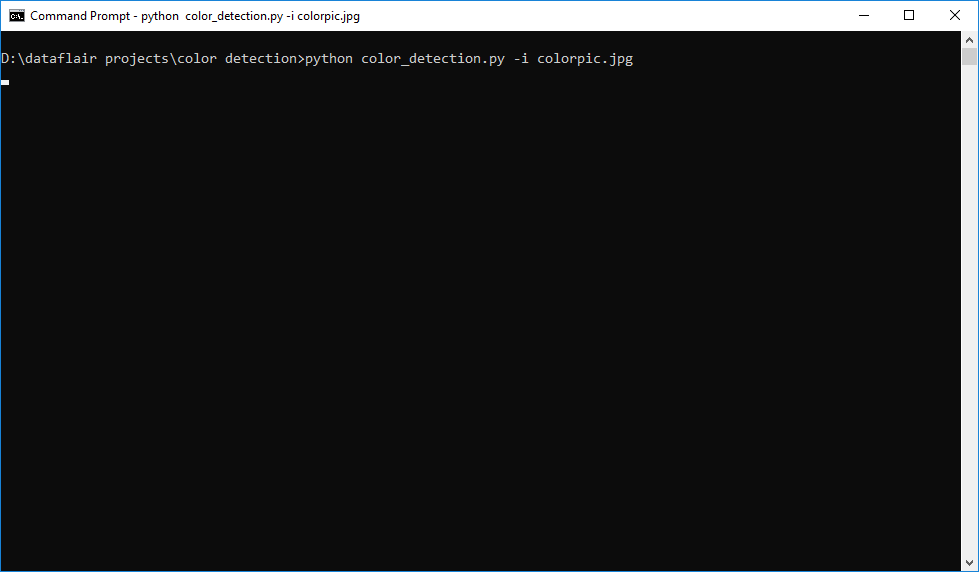
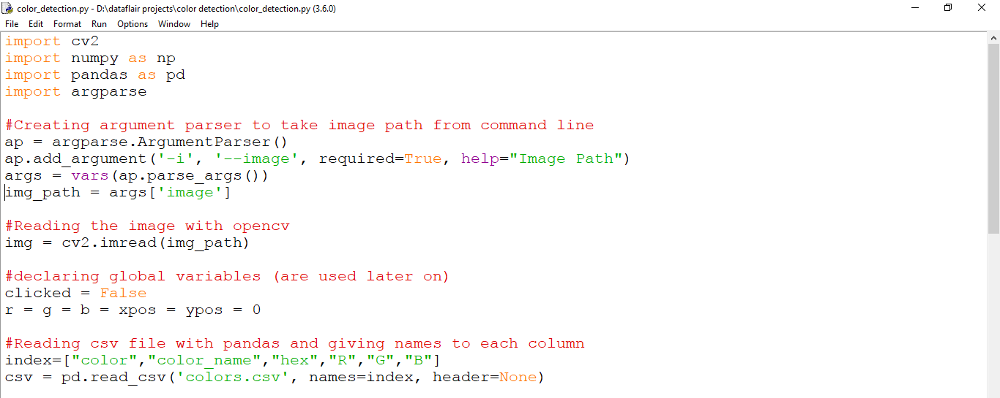
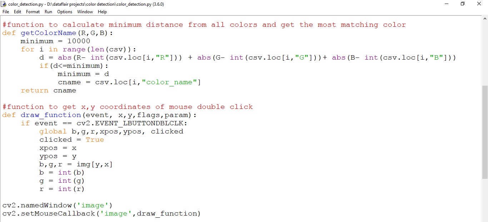
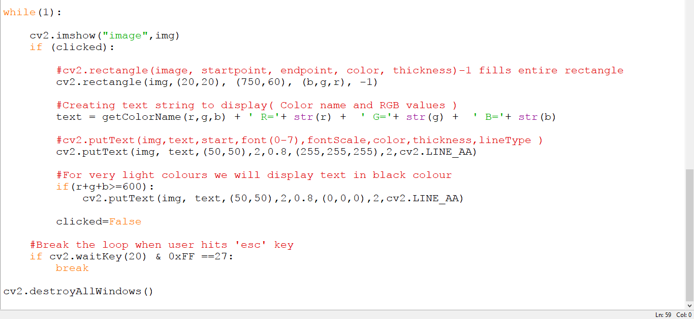
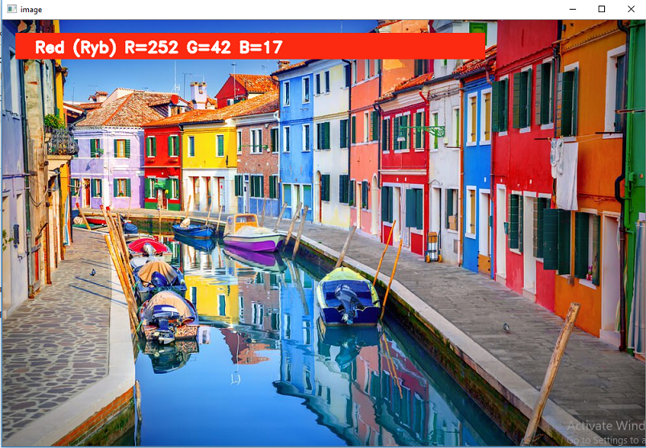
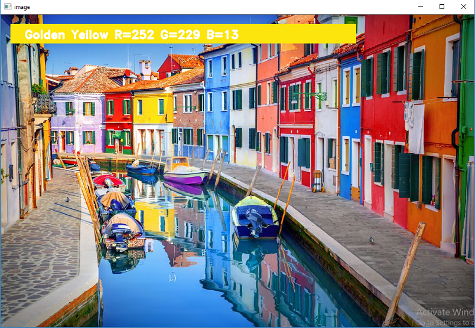
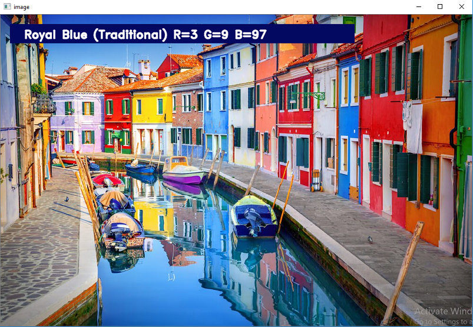

**What is Colour Detection?**

Colour detection is the process of detecting the name of any color. Simple isn’t it? Well, for humans this is an extremely easy task but for computers, it is not straightforward. Human eyes and brains work together to translate light into color. Light receptors that are present in our eyes transmit the signal to the brain. Our brain then recognizes the color. Since childhood, we have mapped certain lights with their color names. We will be using the somewhat same strategy to detect color names.

About the Python Project

In this color detection Python project, we are going to build an application through which you can automatically get the name of the color by clicking on them. So for this, we will have a data file that contains the color name and its values. Then we will calculate the distance from each color and find the shortest one.

**The Dataset**

Colors are made up of 3 primary colors; red, green, and blue. In computers, we define each color value within a range of 0 to 255. So in how many ways we can define a color? The answer is 256\*256\*256 = 16,581,375. There are approximately 16.5 million different ways to represent a color. In our dataset, we need to map each color’s values with their corresponding names. But don’t worry, we don’t need to map all the values. We will be using a dataset that contains RGB values with their corresponding names. The CSV file for our dataset has been taken from this link:

[**Colors Dataset**](https://github.com/codebrainz/color-names/blob/master/output/colors.csv)

The colors.csv file includes 865 color names along with their RGB and hex values.

**Prerequisites**

Before starting with this Python project with source code, you should be familiar with the computer vision library of Python that is [**OpenCV**](https://data-flair.training/blogs/opencv-python-tutorial/) and [**Pandas**](https://data-flair.training/blogs/pandas-tutorials-home/).

OpenCV, Pandas, and numpy are the Python packages that are necessary for this project in Python. To install them, simply run this pip command in your terminal:

pip install opencv-python numpy pandas

**Steps for Building a Project in Python – Color Detection**

Here are the steps to build an application in Python that can detect colors:

**1. Download and unzip the zip file**

[Color Detection Zip File](https://drive.google.com/open?id=1pbiX55FY0ohdlGfLyed0SDZ6vGQPKNkW)

The project folder contains 3 files:

- **Color\_detection.py** – main source code of our project.
- **Colorpic.jpg** – sample image for experimenting.
- **Colors.csv** – a file that contains our dataset.

**2. Taking an image from the user**

We are using argparse library to create an argument parser. We can directly give an image path from the command prompt:

import argparse

ap = argparse.ArgumentParser()

ap.add\_argument('-i', '--image', required=True, help="Image Path")

args = vars(ap.parse\_args())

img\_path = args['image']

#Reading image with opencv

img = cv2.imread(img\_path)

**3. Next, we read the CSV file with pandas**

The pandas library is very useful when we need to perform various operations on data files like CSV. **pd.read\_csv()** reads the CSV file and loads it into the pandas DataFrame. We have assigned each column with a name for easy accessing.

#Reading csv file with pandas and giving names to each column

index=["color","color\_name","hex","R","G","B"]

csv = pd.read\_csv('colors.csv', names=index, header=None)

**4. Set a mouse callback event on a window**

First, we created a window in which the input image will display. Then, we set a callback function which will be called when a mouse event happens.

cv2.namedWindow('image')

cv2.setMouseCallback('image',draw\_function)

With these lines, we named our window as ‘image’ and set a callback function which will call the **draw\_function()** whenever a mouse event occurs.

**5. Create the draw\_function**

It will calculate the rgb values of the pixel which we double click. The function parameters have the event name, (x,y) coordinates of the mouse position, etc. In the function, we check if the event is double-clicked then we calculate and set the r,g,b values along with x,y positions of the mouse.

def draw\_function(event, x,y,flags,param):

`    `if event == cv2.EVENT\_LBUTTONDBLCLK:

`        `global b,g,r,xpos,ypos, clicked

`        `clicked = True

`        `xpos = x

`        `ypos = y

`        `b,g,r = img[y,x]

`        `b = int(b)

`        `g = int(g)

`        `r = int(r)

**6. Calculate distance to get color name**

We have the r,g and b values. Now, we need another function which will return us the color name from RGB values. To get the color name, we calculate a distance(d) which tells us how close we are to color and choose the one having minimum distance.

Our distance is calculated by this formula:

*d = abs(Red – ithRedColor) + (Green – ithGreenColor) + (Blue – ithBlueColor)*

def getColorName(R,G,B):

`    `minimum = 10000

`    `for i in range(len(csv)):

`        `d = abs(R- int(csv.loc[i,"R"])) + abs(G- int(csv.loc[i,"G"]))+ abs(B- int(csv.loc[i,"B"]))

`        `if(d<=minimum):

`            `minimum = d

`            `cname = csv.loc[i,"color\_name"]

`    `return cname

**7. Display image on the window**

Whenever a double click event occurs, it will update the color name and RGB values on the window.

Using the **cv2.imshow()** function, we draw the image on the window. When the user double clicks the window, we draw a rectangle and get the color name to draw text on the window using **cv2.rectangle** and **cv2.putText()** functions.

while(1):

`    `cv2.imshow("image",img)

`    `if (clicked):

`        `#cv2.rectangle(image, startpoint, endpoint, color, thickness) -1 thickness fills rectangle entirely

`        `cv2.rectangle(img,(20,20), (750,60), (b,g,r), -1)

`        `#Creating text string to display ( Color name and RGB values )

`        `text = getColorName(r,g,b) + ' R='+ str(r) + ' G='+ str(g) + ' B='+ str(b)

`        `#cv2.putText(img,text,start,font(0-7), fontScale, color, thickness, lineType, (optional bottomLeft bool) )

`        `cv2.putText(img, text,(50,50),2,0.8,(255,255,255),2,cv2.LINE\_AA)

`  `#For very light colours we will display text in black colour

`        `if(r+g+b>=600):

`            `cv2.putText(img, text,(50,50),2,0.8,(0,0,0),2,cv2.LINE\_AA)

`        `clicked=False

`    `#Break the loop when user hits 'esc' key 

`    `if cv2.waitKey(20) & 0xFF ==27:

`        `break

cv2.destroyAllWindows()

**8. Run Python File**

The beginner Python project is now complete, you can run the Python file from the command prompt. Make sure to give an image path using ‘-i’ argument. If the image is in another directory, then you need to give full path of the image:

python color\_detection.py -i <add your image path here>

**Screenshots:**

**Output:**

Double click on the window to know the name of the pixel color

**Summary**

In this Python project with source code, we learned about colors and how we can extract color RGB values and the color name of a pixel. We learned how to handle events like double-clicking on the window and saw how to read CSV files with pandas and perform operations on data. This is used in numerous image editing and drawing apps.

