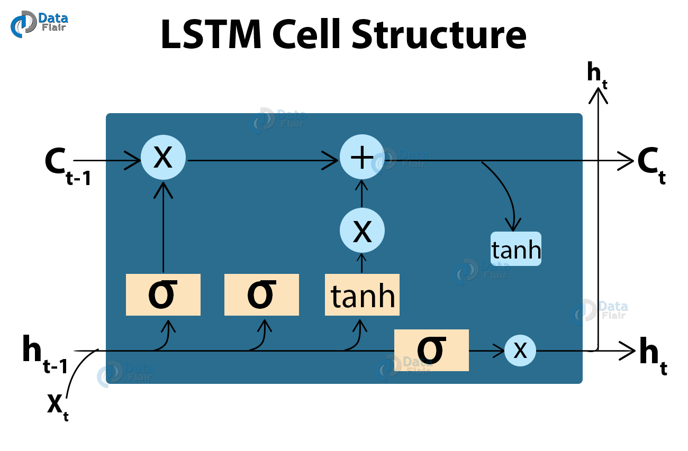
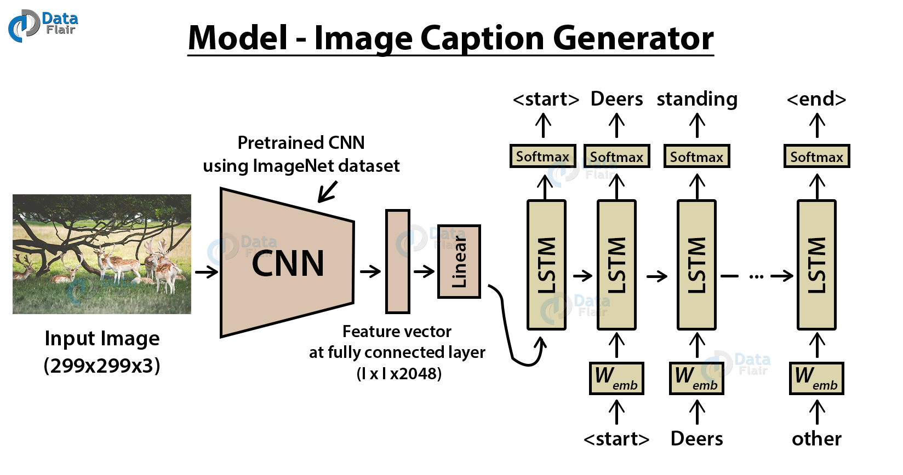
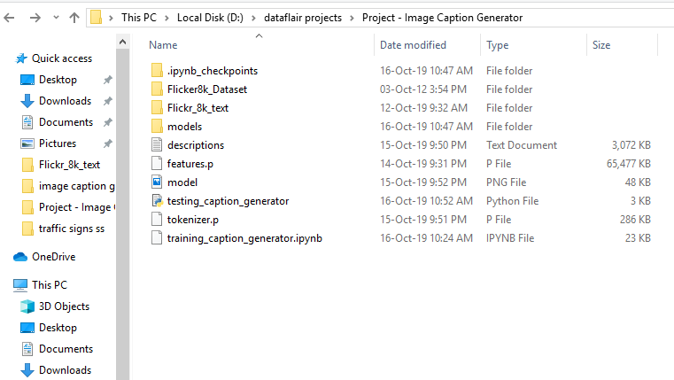
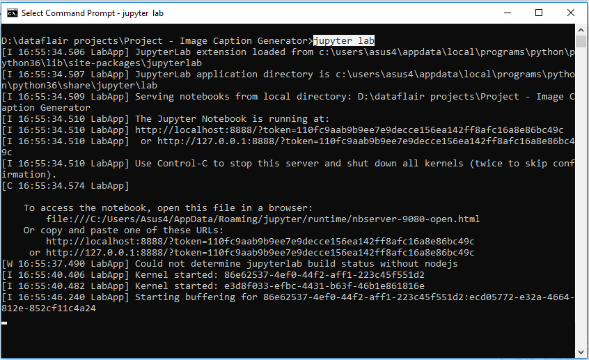
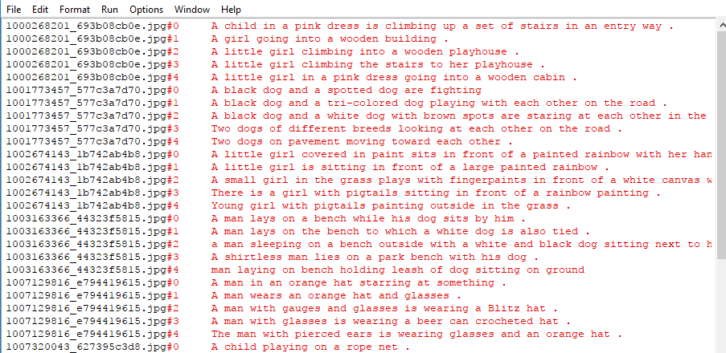
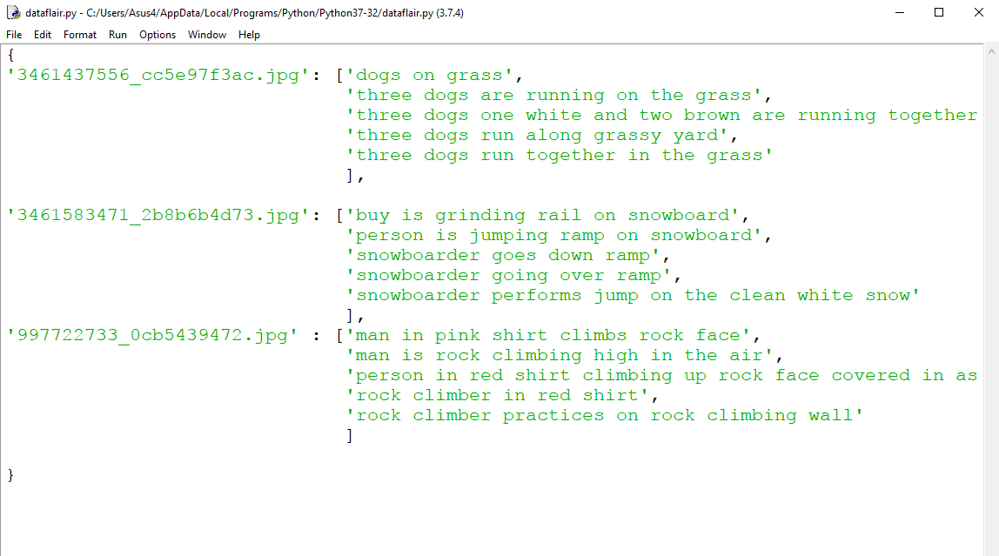
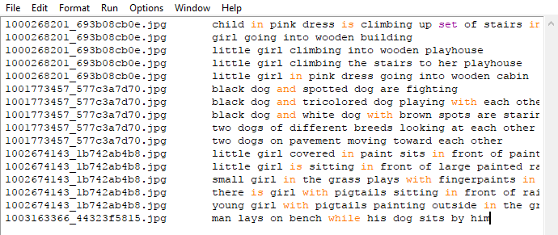
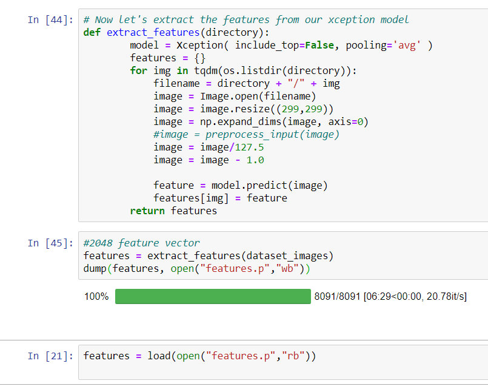

**What is Image Caption Generator?**

Image caption generator is a task that involves computer vision and natural language processing concepts to recognize the context of an image and describe them in a natural language like English.

**Image Caption Generator with CNN – About the Python based Project**

The objective of our project is to learn the concepts of a CNN and LSTM model and build a working model of Image caption generator by implementing CNN with LSTM.

In this Python project, we will be implementing the caption generator using [***CNN (Convolutional Neural Networks)*** ](https://data-flair.training/blogs/convolutional-neural-networks-tutorial/)and LSTM (Long short term memory). The image features will be extracted from Xception which is a CNN model trained on the imagenet dataset and then we feed the features into the LSTM model which will be responsible for generating the image captions.

**The Dataset of Python based Project**

For the image caption generator, we will be using the Flickr\_8K dataset. There are also other big datasets like Flickr\_30K and MSCOCO dataset but it can take weeks just to train the network so we will be using a small Flickr8k dataset. The advantage of a huge dataset is that we can build better models.

Thanks to Jason Brownlee for providing a direct link to download the dataset (Size: 1GB).

- [Flicker8k_Dataset ](https://github.com/jbrownlee/Datasets/releases/download/Flickr8k/Flickr8k_Dataset.zip)
- [Flickr_8k_text ](https://github.com/jbrownlee/Datasets/releases/download/Flickr8k/Flickr8k_text.zip)

The Flickr\_8k\_text folder contains file Flickr8k.token which is the main file of our dataset that contains image name and their respective captions separated by newline(“\n”).

**Pre-requisites**

This project requires good knowledge of Deep learning, Python, working on Jupyter notebooks, Keras library, Numpy, and [***Natural language processing***](https://data-flair.training/blogs/nlp-natural-language-processing/).

Make sure you have installed all the following necessary libraries:

- pip install tensorflow
- keras
- pillow
- numpy
- tqdm
- jupyterlab

**Image Caption Generator – Python based Project**

**What is CNN?**

Convolutional Neural networks are specialized deep neural networks which can process the data that has input shape like a 2D matrix. Images are easily represented as a 2D matrix and CNN is very useful in working with images.

CNN is basically used for image classifications and identifying if an image is a bird, a plane or Superman, etc.

It scans images from left to right and top to bottom to pull out important features from the image and combines the feature to classify images. It can handle the images that have been translated, rotated, scaled and changes in perspective.

**What is LSTM?**

LSTM stands for **Long short term memory**, they are a type of RNN (**recurrent neural network**) which is well suited for sequence prediction problems. Based on the previous text, we can predict what the next word will be. It has proven itself effective from the traditional RNN by overcoming the limitations of RNN which had short term memory. LSTM can carry out relevant information throughout the processing of inputs and with a forget gate, it discards non-relevant information.

This is what an LSTM cell looks like –

**Image Caption Generator Model**

So, to make our image caption generator model, we will be merging these architectures. It is also called a CNN-RNN model.

- CNN is used for extracting features from the image. We will use the pre-trained model Xception.
- LSTM will use the information from CNN to help generate a description of the image.

**Project File Structure**

Downloaded from dataset:

- **Flicker8k\_Dataset –** Dataset folder which contains 8091 images.
- **Flickr\_8k\_text –** Dataset folder which contains text files and captions of images.

The below files will be created by us while making the project.

- **Models –** It will contain our trained models.
- **Descriptions.txt –** This text file contains all image names and their captions after preprocessing.
- **Features.p –** Pickle object that contains an image and their feature vector extracted from the Xception pre-trained CNN model.
- **Tokenizer.p –** Contains tokens mapped with an index value.
- **Model.png –** Visual representation of dimensions of our project.
- **Testing\_caption\_generator.py –** Python file for generating a caption of any image.
- **Training\_caption\_generator.ipynb –** Jupyter notebook in which we train and build our image caption generator.

You can download all the files from the link:

[**Image Caption Generator – Python Project Files**](https://drive.google.com/open?id=13oJ_9jeylTmW7ivmuNmadwraWceHoQbK)

**Building the Python based Project**

Let’s start by initializing the jupyter notebook server by typing jupyter lab in the console of your project folder. It will open up the interactive Python notebook where you can run your code. Create a Python3 notebook and name it **training\_caption\_generator.ipynb**

**1. First, we import all the necessary packages**

import string

import numpy as np

from PIL import Image

import os

from pickle import dump, load

import numpy as np

from keras.applications.xception import Xception, preprocess\_input

from keras.preprocessing.image import load\_img, img\_to\_array

from keras.preprocessing.text import Tokenizer

from keras.preprocessing.sequence import pad\_sequences

from keras.utils import to\_categorical

from keras.layers.merge import add

from keras.models import Model, load\_model

from keras.layers import Input, Dense, LSTM, Embedding, Dropout

\# small library for seeing the progress of loops.

from tqdm import tqdm\_notebook as tqdm

tqdm().pandas()

**2. Getting and performing data cleaning**

The main text file which contains all image captions is **Flickr8k.token** in our **Flickr\_8k\_text** folder.

Have a look at the file –

The format of our file is image and caption separated by a new line (“\n”).

Each image has 5 captions and we can see that #(0 to 5)number is assigned for each caption.

We will define 5 functions:

- **load\_doc( filename ) –** For loading the document file and reading the contents inside the file into a string.
- **all\_img\_captions( filename ) –** This function will create a **descriptions** dictionary that maps images with a list of 5 captions. The descriptions dictionary will look something like this:

- **cleaning\_text( descriptions) –** This function takes all descriptions and performs data cleaning. This is an important step when we work with textual data, according to our goal, we decide what type of cleaning we want to perform on the text. In our case, we will be removing punctuations, converting all text to lowercase and removing words that contain numbers.
  So, a caption like “A man riding on a three-wheeled wheelchair” will be transformed into “man riding on three wheeled wheelchair”
- **text\_vocabulary( descriptions ) –** This is a simple function that will separate all the unique words and create the vocabulary from all the descriptions.
- **save\_descriptions( descriptions, filename ) –** This function will create a list of all the descriptions that have been preprocessed and store them into a file. We will create a descriptions.txt file to store all the captions. It will look something like this:

**Code :**

\# Loading a text file into memory

def load\_doc(filename):

`    `# Opening the file as read only

`    `file = open(filename, 'r')

`    `text = file.read()

`    `file.close()

`    `return text

\# get all imgs with their captions

def all\_img\_captions(filename):

`    `file = load\_doc(filename)

`    `captions = file.split('\n')

`    `descriptions ={}

`    `for caption in captions[:-1]:

`        `img, caption = caption.split('\t')

`        `if img[:-2] not in descriptions:

`            `descriptions[img[:-2]] = [ caption ]

`        `else:

`            `descriptions[img[:-2]].append(caption)

`    `return descriptions

#Data cleaning- lower casing, removing puntuations and words containing numbers

def cleaning\_text(captions):

`    `table = str.maketrans('','',string.punctuation)

`    `for img,caps in captions.items():

`        `for i,img\_caption in enumerate(caps):

`            `img\_caption.replace("-"," ")

`            `desc = img\_caption.split()

`            `#converts to lowercase

`            `desc = [word.lower() for word in desc]

`            `#remove punctuation from each token

`            `desc = [word.translate(table) for word in desc]

`            `#remove hanging 's and a 

`            `desc = [word for word in desc if(len(word)>1)]

`            `#remove tokens with numbers in them

`            `desc = [word for word in desc if(word.isalpha())]

`            `#convert back to string

`            `img\_caption = ' '.join(desc)

`            `captions[img][i]= img\_caption

`    `return captions

def text\_vocabulary(descriptions):

`    `# build vocabulary of all unique words

`    `vocab = set()

`    `for key in descriptions.keys():

`        `[vocab.update(d.split()) for d in descriptions[key]]

`    `return vocab

#All descriptions in one file 

def save\_descriptions(descriptions, filename):

`    `lines = list()

`    `for key, desc\_list in descriptions.items():

`        `for desc in desc\_list:

`            `lines.append(key + '\t' + desc )

`    `data = "\n".join(lines)

`    `file = open(filename,"w")

`    `file.write(data)

`    `file.close()

\# Set these path according to project folder in you system

dataset\_text = "D:\dataflair projects\Project - Image Caption Generator\Flickr\_8k\_text"

dataset\_images = "D:\dataflair projects\Project - Image Caption Generator\Flicker8k\_Dataset"

#we prepare our text data

filename = dataset\_text + "/" + "Flickr8k.token.txt"

#loading the file that contains all data

#mapping them into descriptions dictionary img to 5 captions

descriptions = all\_img\_captions(filename)

print("Length of descriptions =" ,len(descriptions))

#cleaning the descriptions

clean\_descriptions = cleaning\_text(descriptions)

#building vocabulary 

vocabulary = text\_vocabulary(clean\_descriptions)

print("Length of vocabulary = ", len(vocabulary))

#saving each description to file 

save\_descriptions(clean\_descriptions, "descriptions.txt")

**3. Extracting the feature vector from all images** 

This technique is also called transfer learning, we don’t have to do everything on our own, we use the pre-trained model that have been already trained on large datasets and extract the features from these models and use them for our tasks. We are using the Xception model which has been trained on imagenet dataset that had 1000 different classes to classify. We can directly import this model from the keras.applications . Make sure you are connected to the internet as the weights get automatically downloaded. Since the Xception model was originally built for imagenet, we will do little changes for integrating with our model. One thing to notice is that the Xception model takes 299\*299\*3 image size as input. We will remove the last classification layer and get the 2048 feature vector.

model = Xception( include\_top=False, pooling=’avg’ )

The function **extract\_features()** will extract features for all images and we will map image names with their respective feature array. Then we will dump the features dictionary into a “features.p” pickle file.

**Code:**

def extract\_features(directory):

`        `model = Xception( include\_top=False, pooling='avg' )

`        `features = {}

`        `for img in tqdm(os.listdir(directory)):

`            `filename = directory + "/" + img

`            `image = Image.open(filename)

`            `image = image.resize((299,299))

`            `image = np.expand\_dims(image, axis=0)

`            `#image = preprocess\_input(image)

`            `image = image/127.5

`            `image = image - 1.0

`            `feature = model.predict(image)

`            `features[img] = feature

`        `return features

#2048 feature vector

features = extract\_features(dataset\_images)

dump(features, open("features.p","wb"))

This process can take a lot of time depending on your system. I am using an Nvidia 1050 GPU for training purpose so it took me around 7 minutes for performing this task. However, if you are using CPU then this process might take 1-2 hours. You can comment out the code and directly load the features from our pickle file.

features = load(open("features.p","rb"))

**4. Loading dataset for Training the model**

In our **Flickr\_8k\_test** folder, we have **Flickr\_8k.trainImages.txt** file that contains a list of 6000 image names that we will use for training.

For loading the training dataset, we need more functions:

- **load\_photos( filename ) –** This will load the text file in a string and will return the list of image names.
- **load\_clean\_descriptions( filename, photos ) –** This function will create a dictionary that contains captions for each photo from the list of photos. We also append the <start> and <end> identifier for each caption. We need this so that our LSTM model can identify the starting and ending of the caption.
- **load\_features(photos) –** This function will give us the dictionary for image names and their feature vector which we have previously extracted from the Xception model.

**Code :**

#load the data 

def load\_photos(filename):

`    `file = load\_doc(filename)

`    `photos = file.split("\n")[:-1]

`    `return photos

def load\_clean\_descriptions(filename, photos): 

`    `#loading clean\_descriptions

`    `file = load\_doc(filename)

`    `descriptions = {}

`    `for line in file.split("\n"):

`        `words = line.split()

`        `if len(words)<1 :

`            `continue

`        `image, image\_caption = words[0], words[1:]

`        `if image in photos:

`            `if image not in descriptions:

`                `descriptions[image] = []

`            `desc = '<start> ' + " ".join(image\_caption) + ' <end>'

`            `descriptions[image].append(desc)

`    `return descriptions

def load\_features(photos):

`    `#loading all features

`    `all\_features = load(open("features.p","rb"))

`    `#selecting only needed features

`    `features = {k:all\_features[k] for k in photos}

`    `return features

filename = dataset\_text + "/" + "Flickr\_8k.trainImages.txt"

#train = loading\_data(filename)

train\_imgs = load\_photos(filename)

train\_descriptions = load\_clean\_descriptions("descriptions.txt", train\_imgs)

train\_features = load\_features(train\_imgs)

**5. Tokenizing the vocabulary** 

Computers don’t understand English words, for computers, we will have to represent them with numbers. So, we will map each word of the vocabulary with a unique index value. Keras library provides us with the tokenizer function that we will use to create tokens from our vocabulary and save them to a **“tokenizer.p”** pickle file.

**Code:**

#converting dictionary to clean list of descriptions

def dict\_to\_list(descriptions):

`    `all\_desc = []

`    `for key in descriptions.keys():

`        `[all\_desc.append(d) for d in descriptions[key]]

`    `return all\_desc

#creating tokenizer class 

#this will vectorise text corpus

#each integer will represent token in dictionary

from keras.preprocessing.text import Tokenizer

def create\_tokenizer(descriptions):

`    `desc\_list = dict\_to\_list(descriptions)

`    `tokenizer = Tokenizer()

`    `tokenizer.fit\_on\_texts(desc\_list)

`    `return tokenizer

\# give each word an index, and store that into tokenizer.p pickle file

tokenizer = create\_tokenizer(train\_descriptions)

dump(tokenizer, open('tokenizer.p', 'wb'))

vocab\_size = len(tokenizer.word\_index) + 1

vocab\_size

Our vocabulary contains 7577 words.

We calculate the maximum length of the descriptions. This is important for deciding the model structure parameters. Max\_length of description is 32.

#calculate maximum length of descriptions

def max\_length(descriptions):

`    `desc\_list = dict\_to\_list(descriptions)

`    `return max(len(d.split()) for d in desc\_list)

max\_length = max\_length(descriptions)

max\_length

**6. Create Data generator**

Let us first see how the input and output of our model will look like. To make this task into a supervised learning task, we have to provide input and output to the model for training. We have to train our model on 6000 images and each image will contain 2048 length feature vector and caption is also represented as numbers. This amount of data for 6000 images is not possible to hold into memory so we will be using a generator method that will yield batches.

The generator will yield the input and output sequence.

**For example:**

The input to our model is [x1, x2] and the output will be y, where x1 is the 2048 feature vector of that image, x2 is the input text sequence and y is the output text sequence that the model has to predict.

|x1(feature vector)|x2(Text sequence)|y(word to predict)|
| :- | :- | :- |
|feature|start,|two|
|feature|start, two|dogs|
|feature|start, two, dogs|drink|
|feature|start, two, dogs, drink|water|
|feature|start, two, dogs, drink, water|end|
#create input-output sequence pairs from the image description.

#data generator, used by model.fit\_generator()

def data\_generator(descriptions, features, tokenizer, max\_length):

`    `while 1:

`        `for key, description\_list in descriptions.items():

`            `#retrieve photo features

`            `feature = features[key][0]

`            `input\_image, input\_sequence, output\_word = create\_sequences(tokenizer, max\_length, description\_list, feature)

`            `yield [[input\_image, input\_sequence], output\_word]

def create\_sequences(tokenizer, max\_length, desc\_list, feature):

`    `X1, X2, y = list(), list(), list()

`    `# walk through each description for the image

`    `for desc in desc\_list:

`        `# encode the sequence

`        `seq = tokenizer.texts\_to\_sequences([desc])[0]

`        `# split one sequence into multiple X,y pairs

`        `for i in range(1, len(seq)):

`            `# split into input and output pair

`            `in\_seq, out\_seq = seq[:i], seq[i]

`            `# pad input sequence

`            `in\_seq = pad\_sequences([in\_seq], maxlen=max\_length)[0]

`            `# encode output sequence

`            `out\_seq = to\_categorical([out\_seq], num\_classes=vocab\_size)[0]

`            `# store

`            `X1.append(feature)

`            `X2.append(in\_seq)

`            `y.append(out\_seq)

`    `return np.array(X1), np.array(X2), np.array(y)

#You can check the shape of the input and output for your model

[a,b],c = next(data\_generator(train\_descriptions, features, tokenizer, max\_length))

a.shape, b.shape, c.shape

#((47, 2048), (47, 32), (47, 7577))

**7. Defining the CNN-RNN model**

To define the structure of the model, we will be using the Keras Model from Functional API. It will consist of three major parts:

- **Feature Extractor –** The feature extracted from the image has a size of 2048, with a dense layer, we will reduce the dimensions to 256 nodes.
- **Sequence Processor –** An embedding layer will handle the textual input, followed by the LSTM layer.
- **Decoder –** By merging the output from the above two layers, we will process by the dense layer to make the final prediction. The final layer will contain the number of nodes equal to our vocabulary size.

Visual representation of the final model is given below –

from keras.utils import plot\_model

\# define the captioning model

def define\_model(vocab\_size, max\_length):

`    `# features from the CNN model squeezed from 2048 to 256 nodes

`    `inputs1 = Input(shape=(2048,))

`    `fe1 = Dropout(0.5)(inputs1)

`    `fe2 = Dense(256, activation='relu')(fe1)

`    `# LSTM sequence model

`    `inputs2 = Input(shape=(max\_length,))

`    `se1 = Embedding(vocab\_size, 256, mask\_zero=True)(inputs2)

`    `se2 = Dropout(0.5)(se1)

`    `se3 = LSTM(256)(se2)

`    `# Merging both models

`    `decoder1 = add([fe2, se3])

`    `decoder2 = Dense(256, activation='relu')(decoder1)

`    `outputs = Dense(vocab\_size, activation='softmax')(decoder2)

`    `# tie it together [image, seq] [word]

`    `model = Model(inputs=[inputs1, inputs2], outputs=outputs)

`    `model.compile(loss='categorical\_crossentropy', optimizer='adam')

`    `# summarize model

`    `print(model.summary())

`    `plot\_model(model, to\_file='model.png', show\_shapes=True)

`    `return model

**8. Training the model**

To train the model, we will be using the 6000 training images by generating the input and output sequences in batches and fitting them to the model using model.fit\_generator() method. We also save the model to our models folder. This will take some time depending on your system capability.

\# train our model

print('Dataset: ', len(train\_imgs))

print('Descriptions: train=', len(train\_descriptions))

print('Photos: train=', len(train\_features))

print('Vocabulary Size:', vocab\_size)

print('Description Length: ', max\_length)

model = define\_model(vocab\_size, max\_length)

epochs = 10

steps = len(train\_descriptions)

\# making a directory models to save our models

os.mkdir("models")

for i in range(epochs):

`    `generator = data\_generator(train\_descriptions, train\_features, tokenizer, max\_length)

`    `model.fit\_generator(generator, epochs=1, steps\_per\_epoch= steps, verbose=1)

`    `model.save("models/model\_" + str(i) + ".h5")

**9. Testing the model**

The model has been trained, now, we will make a separate file testing\_caption\_generator.py which will load the model and generate predictions. The predictions contain the max length of index values so we will use the same tokenizer.p pickle file to get the words from their index values.

**Code:**

import numpy as np

from PIL import Image

import matplotlib.pyplot as plt

import argparse

ap = argparse.ArgumentParser()

ap.add\_argument('-i', '--image', required=True, help="Image Path")

args = vars(ap.parse\_args())

img\_path = args['image']

def extract\_features(filename, model):

`        `try:

`            `image = Image.open(filename)

`        `except:

`            `print("ERROR: Couldn't open image! Make sure the image path and extension is correct")

`        `image = image.resize((299,299))

`        `image = np.array(image)

`        `# for images that has 4 channels, we convert them into 3 channels

`        `if image.shape[2] == 4: 

`            `image = image[..., :3]

`        `image = np.expand\_dims(image, axis=0)

`        `image = image/127.5

`        `image = image - 1.0

`        `feature = model.predict(image)

`        `return feature

def word\_for\_id(integer, tokenizer):

for word, index in tokenizer.word\_index.items():

`     `if index == integer:

`         `return word

return None

def generate\_desc(model, tokenizer, photo, max\_length):

`    `in\_text = 'start'

`    `for i in range(max\_length):

`        `sequence = tokenizer.texts\_to\_sequences([in\_text])[0]

`        `sequence = pad\_sequences([sequence], maxlen=max\_length)

`        `pred = model.predict([photo,sequence], verbose=0)

`        `pred = np.argmax(pred)

`        `word = word\_for\_id(pred, tokenizer)

`        `if word is None:

`            `break

`        `in\_text += ' ' + word

`        `if word == 'end':

`            `break

`    `return in\_text

#path = 'Flicker8k\_Dataset/111537222\_07e56d5a30.jpg'

max\_length = 32

tokenizer = load(open("tokenizer.p","rb"))

model = load\_model('models/model\_9.h5')

xception\_model = Xception(include\_top=False, pooling="avg")

photo = extract\_features(img\_path, xception\_model)

img = Image.open(img\_path)

description = generate\_desc(model, tokenizer, photo, max\_length)

print("\n\n")

print(description)

plt.imshow(img)

